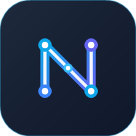
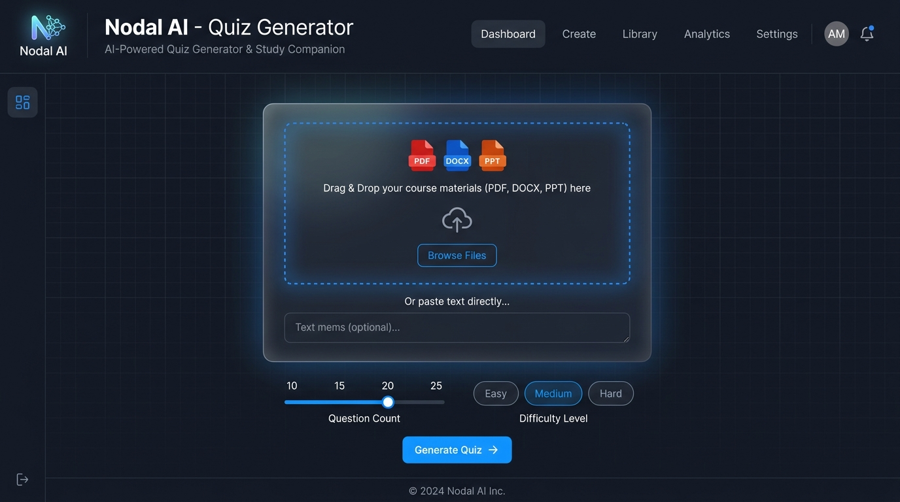
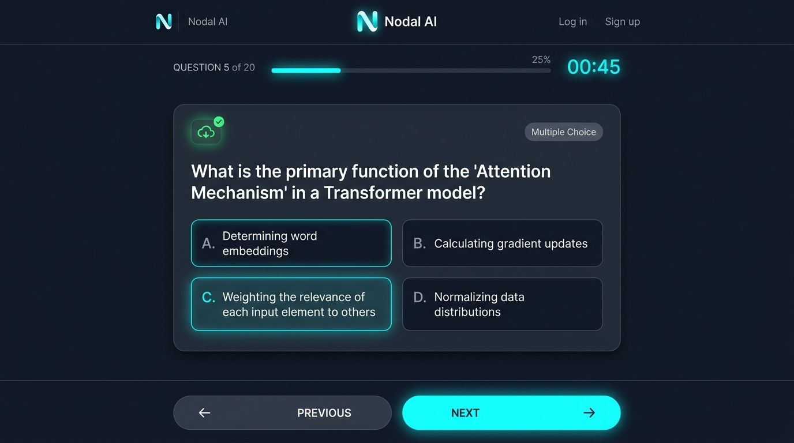
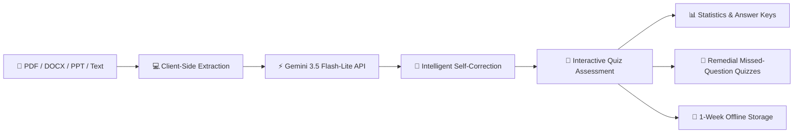

# Nodal AI — AI-Powered Quiz Generator & Interactive Study Companion

<div align="center">
  
  <br />
  <a href="#installable-pwa"></a>
  <a href="https://deepmind.google/technologies/gemini/"></a>
  <a href="https://puter.com"></a>
  <a href="#8-1-week-offline-retention--downloads"></a>
  <a href="#terms-of-use"></a>
  <br /><br />
  <p><b>Transform any lecture slide, PDF, textbook chapter, or notes into tailored, interactive practice quizzes in seconds.</b></p>
  <p>
    <a href="https://nodalai-genwebapp.vercel.app/"><b>Explore Live App</b></a> • 
    <a href="https://github.com/cedrickylo/nodalai-genwebapp/issues"><b>Report Bug</b></a> • 
    <a href="https://github.com/cedrickylo/nodalai-genwebapp/issues"><b>Request Feature</b></a>
  </p>
</div>

---

## Table of Contents
- [Purpose of the Website](#purpose-of-the-website)
- [Screenshots & Visual Gallery](#screenshots--visual-gallery)
- [Key Features](#key-features)
  - [1. Universal Multi-Format Document Ingestion](#1-universal-multi-format-document-ingestion)
  - [2. Raw Quiz JSON Pasting & Unified Import Modal](#2-raw-quiz-json-pasting--unified-import-modal)
  - [3. Google Gemini 3.5 Flash-Lite Quiz Engine](#3-google-gemini-35-flash-lite-quiz-engine)
  - [4. 4 Flexible Question Formats](#4-4-flexible-question-formats)
  - [5. Live Quiz Execution & Audio Feedback](#5-live-quiz-execution--audio-feedback)
  - [6. Remedial Quiz Generator](#6-remedial-quiz-generator)
  - [7. Quiz Statistics & Test Review](#7-quiz-statistics--test-review)
  - [8. 1-Week Offline Retention & Downloads](#8-1-week-offline-retention--downloads)
  - [9. Encrypted Data Migration (.nodal)](#9-encrypted-data-migration-nodal)
  - [10. Puter Cloud Sync & Account Dashboard](#10-puter-cloud-sync--account-dashboard)
  - [11. Device Orientation Lock Check & Auto-Rotation Guard](#11-device-orientation-lock-check--auto-rotation-guard)
  - [12. Fluid 60fps GPU Transitions & Accessibility](#12-fluid-60fps-gpu-transitions--accessibility)
- [System Architecture & Data Handling](#system-architecture--data-handling)
- [Privacy Policy](#privacy-policy)
- [Frequently Asked Questions (FAQ)](#frequently-asked-questions-faq)
- [Contributing Guide](#contributing-guide)
- [Legal Disclaimer](#legal-disclaimer)
- [Terms of Use](#terms-of-use)

---

## Purpose of the Website

### The Problem
Studying from dense lecture presentations, 60-page PDF textbooks, and technical documents is inherently passive. Active recall and self-testing are proven to be the most effective study techniques, yet creating practice questions manually is exhausting, time-consuming, and takes hours away from actual learning. Existing automated tools frequently suffer from:
- Forcing mandatory paid subscriptions or accounts before allowing a single question to be generated.
- Storing users' private documents and study materials on insecure, centralized servers.
- Failing without an active internet connection, leaving students stranded before exams.
- Producing malformed, repetitive, or hallucinated questions without recovery mechanisms.

### The Nodal AI Solution
**Nodal AI** is a free, privacy-first, client-driven interactive study companion and assessment platform. It allows students, educators, and lifelong learners to drag and drop their study documents and immediately receive structured, high-yield practice quizzes.

- **Zero Friction**: Works instantly in any modern browser without mandatory sign-up. Guest mode provides full generation, testing, and offline caching capabilities.
- **Client-Side Document Parsing**: Documents are extracted directly in the browser; source documents never get permanently stored on external database servers.
- **Resilient AI Generation**: Integrated self-correction loops detect malformed JSON from the AI and automatically heal responses to ensure a 100% completion rate.
- **True Offline Practice**: Quizzes, scoring histories, and answer keys remain fully interactive on your device even without an internet connection.

---

## Screenshots & Visual Gallery

<div align="center">

### Homepage & Document Ingestion
*Drag & drop lecture slides, PDFs, Word docs, or paste raw AI prompt JSON.*



---

### Interactive Quiz Engine
*Live countdown timers, real-time score counters, Tone.js audio synth feedback, and instant solution validation.*



</div>



---

## Key Features

### 1. Universal Multi-Format Document Ingestion
- **Document Support**: Native support for `.pdf`, `.docx`, `.doc`, `.pptx`, `.ppt`, `.txt`, `.md`, `.rtf`, and `.odt`.
- **PowerPoint Slide XML Parsing**: Uses `JSZip` to traverse presentation XML trees, extracting headers, body content, and bullet hierarchies from slide decks.
- **Homepage Drag & Drop Overlay**: Seamlessly drop files anywhere on the start screen with visual backdrop guidance (`#home-drag-overlay`).
- **In-Memory WeakMap Text Cache**: Re-parsing the same document in a session takes `0ms` via in-memory caching.
- **Multi-File Uploads**: Combine multiple lecture slides or notes into a unified study set using "Add More".

### 2. Raw Quiz JSON Pasting & Unified Import Modal
- **Pasting External AI Prompts**: If you prefer generating questions with external tools (ChatGPT, Claude, Gemini Web, DeepSeek), copy the JSON or markdown code block (` ```json `) and paste it directly into the app.
- **Unified Import Modal (`#import-choice-modal`)**: Clean popup interface letting you select between importing a saved `.json` file from disk or pasting raw text.

### 3. Google Gemini 3.5 Flash-Lite Quiz Engine
- **Serverless Integration**: Hosted on Vercel Serverless Functions (`/api/generate-quiz`), keeping API credentials strictly secured away from client inspection.
- **Intelligent Self-Correction Loop**: If the AI model returns malformed JSON or partial arrays, the engine automatically catches syntax errors, re-queries the model with missing indices, and truncates excess questions to precisely match your target question count.
- **Zero-Wait AI Prompt Fallback**: If the serverless endpoint experiences temporary network outages, the app offers an instantaneous "Copy Prompt & Paste JSON" fallback flow.

### 4. 4 Flexible Question Formats
- **Multiple Choice**: 4 distinct, randomized choices with clean radio selection.
- **Identification**: Free-form text input with intelligent whitespace and case-insensitive normalization.
- **Enumeration**: Multi-item answer challenges requiring recall of lists and sequences.
- **Mixed Mode**: Automatically distributes and balances questions across Multiple Choice, Identification, and Enumeration with real-time breakdown badges.

### 5. Live Quiz Execution & Audio Feedback
- **Timer Modes**: Choose between *Per-Question Countdown* or *Total Quiz Duration* with live progress badges.
- **Interactive Audio Feedback**: Built-in `Tone.js` synthesizer plays gentle harmonic chimes on correct answers and soft chords on misses (fully toggleable via mute button).
- **Auto-Validation & Modification Controls**: Instantly reveal explanations or test yourself under strict exam conditions with locked answers.
- **Question Navigator Drawer**: Jump between answered, skipped, and flagged questions at any time.

### 6. Remedial Quiz Generator
- When finishing a quiz, missed questions are automatically categorized.
- Click **"Generate Remedial Quiz"** to instantly spawn a focused practice exam containing exclusively the questions you answered incorrectly, allowing rapid mastery of weak areas.

### 7. Quiz Statistics & Test Review
- **Retake Tracking**: Compare first-attempt scores against subsequent retakes to measure learning retention over time.
- **Full Historical Test Review**: Reopen any past quiz attempt with complete answer keys, your submitted choices, and detailed explanations.
- **Screen-Centered Responsive Headers**: Smooth sticky navigation headers with auto-collapsing icon controls.

### 8. 1-Week Offline Retention & Downloads
- **Standalone Offline Practice**: Save your generated quizzes to your device for offline study during commutes, flights, or study sessions with spotty Wi-Fi.
- **1-Week Retention Policy**: Automatic calculation of offline cache lifetime, complete with a one-click "Renew for 1 Week" extension button in the Downloads view.
- **Downloads Storage Manager**: Real-time storage calculation showing disk space consumed by cached exams.

### 9. Encrypted Data Migration (.nodal) & Netlify Grace Countdown
- **Domain-to-Domain Portability**: Export your complete quiz database, retake histories, and statistics into an encrypted `.nodal` backup file.
- **AES-256 Encryption & Cryptographic Checksums**: Encrypted with AES-256 and verified with cryptographic hashes to ensure zero data corruption during migration.
- **Netlify Post-Migration 1-Week Grace Countdown**: Exclusive to the legacy Netlify deployment, confirming migration lets users choose between an automated 7-day scheduled profile countdown (with real-time banner display) or immediate forced deletion. Excluded from Vercel deployments.

### 10. Puter Cloud Sync & Account Dashboard
- **Cross-Device Syncing**: Sign in via Puter to automatically sync quizzes and scores across desktop, laptop, and mobile devices.
- **Storage Meter & Profile Management**: Real-time calculation of cloud storage used across quizzes, takes, and cache files, with direct profile edit shortcuts.
- **Fair Use Cooldown Protection**: Smart generation cooldown (2 generations per 3 minutes, 10 per 3 hours) with live countdown timers, preventing quota exhaustion while ensuring failed network requests never penalize your allowance.
- **Permanent Profile Deletion (Signed-In & Signed-Out)**: Dedicated "Delete Nodal Profile" option protected by two-step verification and typing confirmation (`CONFIRM`). For signed-in users, it wipes Puter cloud files, KV keys, local/session storage, caches, and signs out. For guests, it skips cloud calls and purges all local quizzes, takes, and caches.

### 11. Device Orientation Lock Check & Auto-Rotation Guard
- **Respects Device Orientation Lock**: Detects whether your mobile device or operating system has orientation lock enabled (e.g., Portrait Lock / Auto-rotate OFF).
- **Eliminated PWA Manifest Auto-Rotate Overrides**: Removed manifest directives that previously caused mobile Chromium on Android to bypass user system locks and rotate layouts against the user's explicit preference.
- **Layout Stability**: Active orientation monitoring ensures stable portrait viewing geometry with zero awkward reflows.

### 12. Fluid 60fps GPU Transitions & Accessibility
- **Compositor Animations**: Modal dialogs, dropdowns, and toast notifications enter and exit using hardware-accelerated CSS transforms (`translate3d`, `opacity`) for smooth 60fps rendering.
- **Reduce Motion Accessibility Setting**: Website-wide toggle in Account settings that respects `prefers-reduced-motion` and disables all animations. Includes a measured 30Hz stepped transition for sticky header resizing.

---

## System Architecture & Data Handling

### Local Storage Architecture
Nodal AI prioritizes client-side data sovereignty. Data is structured across modern web storage layers:

| Storage Layer | Key / Resource | Purpose |
| :--- | :--- | :--- |
| **`localStorage`** | `AIQuizGeneratorDB_v4` | Local quiz library, questions, choices, explanations |
| **`localStorage`** | `nodal_quiz_takes_v1` | Longitudinal score logs, timestamps, user response records |
| **`localStorage`** | `nodal_offline_downloads_v1` | 1-week offline retention registry and renewal metadata |
| **`localStorage`** | `nodal_reduce_motion` | User accessibility animation preferences |
| **`sessionStorage`** | `nodal_last_review_take` | Active review take payload preserved across tab refreshes |
| **Cache API** | `nodal-ai-cache-v44` | Pre-cached PWA app shell, scripts, styles, and font icons |
| **Puter Filesystem** | `/app/nodal_ai/...` | Sandboxed cloud sync files for authenticated Puter users |

### Client-Side Document Processing
When you select a document (PDF, Word, PowerPoint, or text):

1. The file is read into memory using HTML5 `FileReader` and parsed strictly inside the browser worker/thread (`pdf.js` for PDFs, `mammoth.js` for Word, and `JSZip` for PowerPoint XML).
2. The raw document file is **never uploaded** to an external file server.
3. Only the sanitized, extracted text content required for question generation is sent over TLS to the serverless AI endpoint (`/api/generate-quiz`).
4. Once the questions are generated, the in-memory text buffer is discarded unless cached in local session memory.

---

## Privacy Policy

**Effective Date:** September 10, 2026

At Nodal AI, we believe your educational materials and study habits are strictly your private business.

1. **Zero Tracking & Zero Advertising**: We do not run third-party advertising networks, tracker pixels, cross-site telemetry, or data brokerage analytics.
2. **No Document Retention**: We do not store, catalog, or train public AI models on the source documents you process. Document text is converted in your local browser and sent ephemerally to the AI generation function solely to create your quiz.
3. **Guest Mode Sovereignty**: You can use Nodal AI completely anonymously without an account. All your quizzes, scores, and offline downloads remain safely contained within your local browser storage.
4. **Cloud Sync Transparency & Right to Erasure**: If you choose to log in using Puter, your synced quizzes and take histories are stored inside your own sandboxed Puter cloud filesystem (`puter.com`). You can delete individual quizzes, export your entire library, or use the "Delete Nodal Profile" button to permanently erase all cloud and local records simultaneously.
5. **Encrypted Portability**: The proprietary `.nodal` backup file format uses AES-256 encryption, allowing you to transport your personal data between devices without exposing plaintext content.

---

## Frequently Asked Questions (FAQ)

<details>
<summary><strong>1. Is Nodal AI free to use?</strong></summary>

Yes! Nodal AI is free to use. There are no paywalls, hidden subscriptions, or premium-tier restrictions.

</details>

<details>
<summary><strong>2. Do I need to create an account to take quizzes?</strong></summary>

No. You can generate, customize, take, review, and save quizzes completely as a guest. An optional Puter account is only needed if you want your quizzes and scores to automatically synchronize across multiple devices.

</details>

<details>
<summary><strong>3. What file formats are supported?</strong></summary>

Nodal AI supports:
- **PDF Documents** (`.pdf`)
- **Microsoft Word** (`.docx`, `.doc`)
- **Microsoft PowerPoint** (`.pptx`, `.ppt`)
- **Plain Text & Markdown** (`.txt`, `.md`)
- **Rich Text & OpenDocument** (`.rtf`, `.odt`)
- **Raw JSON Prompts** pasted directly into the import dialog.

</details>

<details>
<summary><strong>4. Why did the app not rotate when I tilted my phone?</strong></summary>

Nodal AI features an automatic **Device Orientation Lock Check**. If your phone's operating system has orientation lock enabled (such as "Portrait Lock" on iOS or "Auto-rotate: OFF" on Android), Nodal AI honors your system preference and prevents the website from rotating sideways. To allow the website to rotate into landscape, simply turn on Auto-rotate in your phone's quick settings / control center.

</details>

<details>
<summary><strong>5. How does the Generation Cooldown work?</strong></summary>

To ensure reliable serverless performance and fair access for all users, Nodal AI enforces a fair-use rate limit of 2 generations per 3-minute window, and up to 10 generations per 3-hour period. If an AI request fails due to an upstream network timeout or temporary outage, it **does not** count against your quota.

</details>

<details>
<summary><strong>6. Can I study completely offline?</strong></summary>

Yes! As an installable Progressive Web App (PWA), Nodal AI caches its core interface via Service Worker. Quizzes saved to your device have a 1-week offline retention period. You can take downloaded quizzes, review answers, and track retake scores with zero internet connectivity. Generating *new* quizzes with Gemini requires an active internet connection.

</details>

<details>
<summary><strong>7. How do Remedial Quizzes work?</strong></summary>

After completing any quiz, the results screen identifies all questions answered incorrectly. Clicking "Generate Remedial Quiz" automatically extracts those exact missed items and packages them into a fresh assessment so you can practice until you achieve 100% mastery.

</details>

<details>
<summary><strong>8. How do I transfer my quizzes to a new computer?</strong></summary>

Open the Account modal and click **Migrate Data (Import / Export)**. Choose **Export**, enter a passphrase to encrypt your data with AES-256, and download the `.nodal` file. On your new device, open the same menu, choose **Import**, select your `.nodal` file, and enter your passphrase to restore your library.

</details>

<details>
<summary><strong>9. How do I delete my profile and all stored data?</strong></summary>

Open the Account modal (available for both signed-in Puter users and signed-out guests) and click <strong>Delete Nodal Profile</strong>. You will be guided through a two-step confirmation, requiring you to type <code>CONFIRM</code> to proceed. If signed in, this permanently deletes all your Puter cloud files and Key-Value records, erases your local quiz library and retakes, wipes offline caches, signs you out, and severs website association. If signed out as a guest, it skips cloud deletion and purges all local storage and caches.

On the legacy Netlify website, users who confirm successful account migration to the new site can also schedule an automatic 1-week deletion countdown or force immediate deletion from the migration guide.

</details>

---

## Contributing Guide

We welcome contributions from educators, designers, and developers! Follow these instructions to contribute to Nodal AI:

### Prerequisites
- [Node.js](https://nodejs.org/) (version 18+ recommended)
- Modern web browser (Chrome, Edge, Firefox, or Safari)
- Optional: [Vercel CLI](https://vercel.com/docs/cli) for testing serverless functions locally (`npm install -g vercel`)

### Local Setup & Development
1. **Fork and Clone the Repository**:
   ```bash
   git clone https://github.com/cedrickylo/nodalai-genwebapp.git
   cd nodalai-genwebapp
   ```

2. **Run a Local Development Server**:
   Because Nodal AI uses standard ES6 modules (`import`/`export`) and Service Workers, run it through any local HTTP server:
   ```bash
   # Using Python 3
   python -m http.server 8080

   # Or using npx serve
   npx serve .
   ```
   Open `http://localhost:8080` in your browser.

3. **Running Serverless API Functions (Optional)**:
   If developing features that modify the Gemini API generation endpoint in `/api/`:
   ```bash
   vercel dev
   ```
   Provide your `GEMINI_API_KEY` in a local `.env` file:
   ```env
   GEMINI_API_KEY=your_google_gemini_api_key_here
   ```

### Code Guidelines & Architecture
- **Vanilla ES6 Modules**: All client logic is organized into modular ES6 files under `scripts/`. Avoid introducing heavy runtime frameworks (React, Vue, etc.) to preserve the lightning-fast loading speed and zero-build simplicity.
- **Tailwind CSS Utility Classes**: Layout styling is built using Tailwind CSS utility classes supplemented by custom CSS in `styles.css` for GPU keyframe animations.
- **Accessibility**: Preserve keyboard navigation, ARIA attributes, semantic header hierarchies, and the `reduce-motion` accessibility classes.
- **Service Worker Protocol**: If modifying pre-cached assets in `scripts/`, `styles.css`, or `index.html`, increment `CACHE_NAME` in `sw.js` (e.g., `nodal-ai-cache-v43`) so browsers immediately activate the changes.

### Submitting a Pull Request
1. Create a feature branch: `git checkout -b feature/your-feature-name`.
2. Commit your changes with clear, descriptive commit messages.
3. Test your changes across desktop and mobile viewports.
4. Push to your fork: `git push origin feature/your-feature-name`.
5. Open a Pull Request on GitHub describing your changes and testing results.

---

## Legal Disclaimer

> [!IMPORTANT]
> **Educational Use Notice:** Nodal AI is provided as an educational study and assessment aid. Quizzes generated by artificial intelligence are synthesized from the source text you provide. While Google Gemini 3.5 Flash-Lite is an advanced reasoning model, automated systems may occasionally produce factual imprecisions, ambiguous answer keys, or context misinterpretations. Always cross-reference generated quiz questions against your official primary textbooks, syllabus materials, and course instructor guidance.

### Limitation of Liability
The creator, developers, and contributors of Nodal AI shall not be held liable for:

- Any academic examination results, grades, or certifications obtained by users.
- Loss of unsynced local data resulting from clearing browser caches, private browsing sessions, or device resets.
- Service interruptions, upstream AI API deprecations, or network downtime.
- Any unauthorized uploading of proprietary, confidential, or copyrighted material by third parties.

---

## Terms of Use

**Last Updated:** September 10, 2026

By accessing or using **Nodal AI** (the "Service"), you agree to be bound by these Terms of Use ("Terms"). If you do not agree to these Terms, please do not use the Service.

### 1. Permitted Use
- Nodal AI is licensed for personal educational study, classroom formative assessments, and professional self-improvement.
- You agree to use the Service in compliance with all applicable local, state, national, and international laws and regulations.

### 2. User Content & Intellectual Property
- **Ownership**: You retain full ownership of the documents, slides, and study notes you upload into the application.
- **Copyright Compliance**: You represent and warrant that you possess the necessary rights, licenses, or fair-use permissions to parse and convert any documents you upload. You agree not to upload materials that infringe on the intellectual property, copyrights, or privacy rights of any third party.
- **Service Trademarks & Code**: The Nodal AI brand, logo, application architecture, styling, and codebase are licensed under the MIT License unless otherwise noted.

### 3. Fair Use & Prohibited Activities
You agree not to:
- Abuse, flood, or programmatically exploit the AI generation endpoints (`/api/generate-quiz`) using bots, scrapers, or automated request scripts.
- Attempt to reverse-engineer, bypass, or tamper with the fair-use cooldown limits or serverless security headers.
- Upload malicious payloads, corrupted archives, or files containing viruses, Trojans, or destructive scripts.
- Use the Service to generate defamatory, obscene, harassing, or unlawful content.

### 4. Third-Party Services
Nodal AI integrates third-party services, including Google Gemini API, Puter.js, and Vercel. Your use of these integrated features is also subject to the respective terms and privacy policies of those providers.

### 5. Termination & Modifications
We reserve the right to suspend or restrict access to the Service for any user who violates these Terms or engages in abusive API consumption. We may update these Terms periodically; continued use of the Service following published updates constitutes acceptance of the modified Terms.

### 6. Contact
For questions, terms inquiries, or bug reports, open an issue on the [GitHub Repository](https://github.com/cedrickylo/nodalai-genwebapp/issues) or contact the project creator [@cedrickylo](https://github.com/cedrickylo).